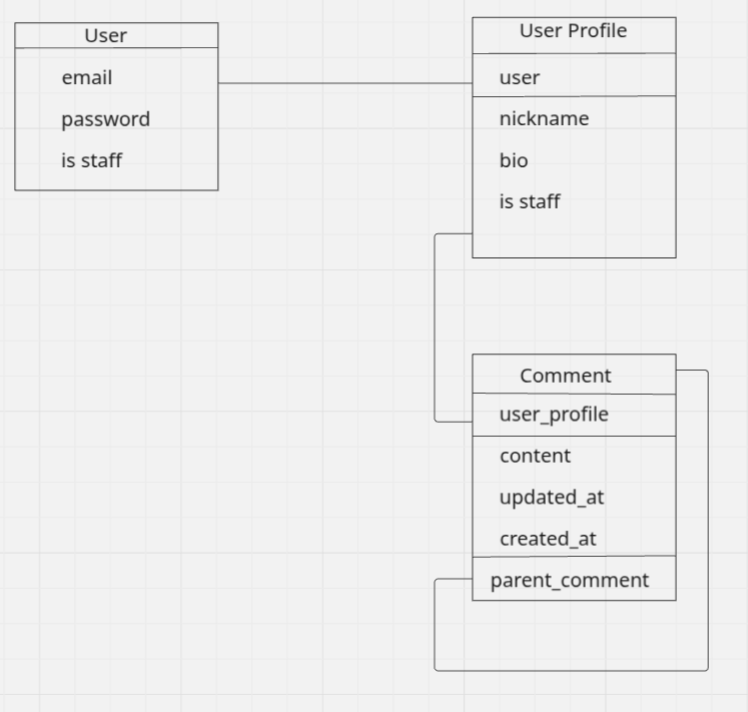

# SPA app


App for publishing, read, comments.

## Mission
This completely useless project for commercial purposes was created to practice developing API applications based on Django.

The second goal of this project is to demonstrate to future employers that I am capable of creating something more substantial than just 'Hello, world.'

## Technology Stack

- **Backend:** Python 3.12.7, Django 4.x, Django REST Framework
- **Database:** Postrges
- **Others:** JWT, Redis, Docker,

## Description


In this app, you can:

- Create comments with some image.
- Add comments to another comments with image.
- Search comments by nickname, email.
- Sort by nickname, email, date.


## Getting Started

These instructions will get you a copy of the project up and running on your local machine for development and testing purposes.

### Prerequisites

Must have:
- a computer with some operating system 
- some free time

### System Requirements

- Python 3.10
- pip (Python package installer)
- Docker


### Installing

A step by step series of examples that tell you how to get a development env running

1. Clone the repository:
    ```
    git clone the-link-from-forked-repo
    ```
2. Open the project folder in your IDE
   
3. Copy .env.example to .env with your settings/
   
4. Run Docker
    ```
    docker compose up --build
    ```

5. If you want use app like user:
    1. Register in app:
        ```
        /api/user/register/
        ```
    2. Get your token:
         ```
        /api/user/token/
        ```
    3. Get your token:
         ```
        /api/spa/create-profile/
        ```


## Permissions

    - Unauthorized users can read comments.

    - Authorized users can create comments and profile, view profile of other users.
    
    - Comments owner can update delete his comments.      
   

## API Endpoints

Major endpoints for interacting with the application:

    Posts:
      - `/api/spa/comments/` - List of posts/add comment.
      - `/api/spa/comments/<id>/` - Manage comment.
      - `/api/spa/comments//<id>/upload_image/` - Upload image for comment
      - `/api/spa/comments//<id>/upload_image/` - Replie for comment
      - `/api/spa/profiles/` - List of profiles/add profile.
      - `/api/spa/profiles/create-profile/` - Create profile.
      - `/api/spa//profiles/<id>/` - Manage profile.
      
    User:
      - `/api/user/register/` - Register a new user .
      - `/api/user/token/` - Obtain token pair.
      - `/api/user/token/refresh/` - Actualize your access token with refresh token .
      - `/api/user/token/verify/` - Verify token if it is valid.
      - `api/user/me/` - Manage your auth details.
      - `api/user/logout/` - Logout (deactivate refresh token).
      
### Swagger API

- `/api/doc/`

### Redoc API

- `/api/doc/redoc/`

### DB Structure:
